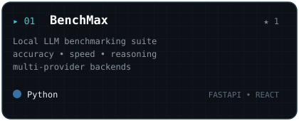
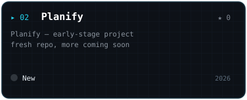
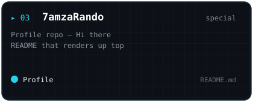

7amzaRando / README.md

  
  
   
  HZ // EG
    

  
  

  ---

  ### ● SELECTED WORK — ./repositories --pinned

  
  
  

   
  3 selected — <a href="https://github.com/7amzaRando?tab=repositories">github.com/7amzaRando?tab=repositories →</a>

  ---

  ### ● CONTRIBUTION MATRIX — auto-updating

  
    
  
  

  ---

  **Hamza — Computer Science student in Egypt.**
   
  I build software, solve problems, and turn data into clear ideas with Python.

